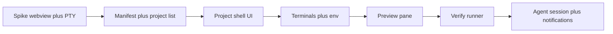

# LemonADE — MVP & product plan

## North star (correct framing)

**LemonADE is an evolution of the IDE**, not an appendage to third-party repositories.

- **Workflow** is organized around **agentic coding**: orchestration, runs, plans, review, verification—not “files first, agents somewhere else.”
- **Window management** means **panels and previews are bound to agent sessions and workspaces**, so focus and notifications always resolve to **meaningful context** (which run, which workspace), not a hunt across Chrome and terminals.
- **Users** should experience **agent-driven development inside one environment** that feels like a **real IDE**, reframed for the agent era—not a separate tool that requires every repo to carry our config.

The earlier mistake was implying the product is **`lemonade.project.json` sprinkled into each codebase**. That is **not** the long-term model. At most, an optional **`.lemonade/`** (or purely app-local workspace state) can hold **hints** (preview URL, verify command); **opening a folder** must work **without** polluting upstream projects.

## Current codebase (honest)

The existing Electron app implements **technical foundation**:

- Electron + Vite + React; **Bun** for scripts.
- **PTY** (`node-pty` + xterm), **BrowserView** preview, verify subprocess, desktop notifications.
- A **temporary** workspace list gated on **`lemonade.project.json`** — useful for a spike, **misaligned** with the north star above.

**Gap:** No **IDE-style Open Folder**, no **agent-run registry / rail**, no **first-class editor or diff review** yet. The UI still reads “project + manifest” instead of “workspace + agent orchestration.”

## Technical stack (still locked)

- **Compose** — integrate agents via subprocesses and adapters; no requirement to fork a vendor IDE.
- **Electron** — Chromium + embedded Node main; **Windows + macOS**.
- **Bun** — `bun install` / `bun run`; **`bun run rebuild:native`** for `node-pty` against Electron’s ABI.
- **Dev UI port** — Vite on **5174** so common app dev ports (e.g. 5173) stay free for previews.
- **IPC** — All `ipcMain.handle` registrations **before** `createWindow()`.

## Phase plan (product-aligned)

### Phase A — IDE workspace (next)

- **File → Open Folder** (and optional multi-root).
- Persist workspace roots in **userData**; **no mandatory repo file**.
- Optional **`.lemonade/settings.json`** (gitignored by default in templates) **or** app-only per-workspace prefs for `previewUrl`, `verifyCommand`, `devPort`.
- **Deprecate** requiring `lemonade.project.json` in foreign repos; keep parser only as migration / import path if needed.

### Phase B — Agent orchestration rail

- First-class **Agent run** entity: id, workspace, status, log handle, linked terminal(s), optional verify hook.
- Sidebar section: **Runs** (active + recent), click restores focus and surfaces (terminal, activity, preview).
- Notifications reference **run id + workspace**, not only a path string.

### Phase C — Review & editor

- **Diff / patch review** for agent-proposed changes.
- Lightweight **editor** surface (e.g. Monaco) or clear **“open in external editor”** bridge until embed is ready.
- **Verify** and test output linked to **files/lines** where possible.

### Phase D — Polish & adapters

- Port policy / proxy, structured test parsing, optional deep adapters for specific CLIs.

## Legacy: `lemonade.project.json` (bridge only)

Until Phase A ships in code, the app may still read this file. Fields were: `name`, `previewUrl`, `devPort`, `verifyCommand`, `agentCommand`. **Do not treat this as the product contract**—treat it as a **spike artifact** to be replaced by workspace settings.

## Implementation order (historical)

The following was the **spike sequence**; future work follows **Phase A–D** above.

## Compose boundaries (long-term)

| In LemonADE | Outside / composed |
|-------------|-------------------|
| Workspace layout, agent run registry, review UI | Specific model providers |
| PTY, preview, verify orchestration | Optional external editor until embed |
| Notifications → run + workspace | Agent CLIs as subprocesses |

## Post-north-star

- Team-shared workspace templates
- Cloud sync (optional)
- Policy-as-code for verify gates
