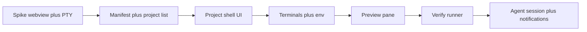

# LemonADE — MVP build plan

**Strategy (locked):** **Compose** — LemonADE is the shell (projects, terminals, preview, verify, notifications). Agents and dev tools are **spawned subprocesses** with **BYO commands**. No forking Codex/Claude/etc.; optional thin adapters later if a vendor exposes stable APIs.

**Desktop stack (locked):** **Electron** — Chromium for UI + embedded **localhost** preview (e.g. `BrowserView` or `<webview>` with a deliberate security model), **Node main process** for `child_process` / **`node-pty`**, OS notifications, and packaging (**electron-builder** or similar). Target **Windows + macOS** from the start. *Optional later:* a different shell (e.g. Tauri) would be a **migration** of the native layer; keep Electron-specific code in a **thin `main`/preload boundary** so the renderer + IPC shapes stay portable.

**Product context:** [README.md](../README.md).

## Primary use: orchestrate agents and review (not a traditional IDE)

If the goal is **running agents, watching runs, and reviewing outcomes** rather than **being the place you type most code**, several priorities shift:

- **Editor is optional, not the platform center.** You do not need a VS Code–class surface (extension host, rich LSP for every language, debugger integration). A **read-biased** experience is enough for v0: open files for context, **syntax highlighting** if cheap, **jump-to-line from logs**, and **“Open in …”** to a full IDE for heavy edits. Later: unified **diff / patch review** (agent proposal vs workspace) matters more than autocomplete.
- **Activity and transcripts win layout.** Large, searchable **agent + verify output**, clear **run state** (running / success / failed), and **scoped notifications** are first-class. Terminals and preview stay tied to **project**, as already planned.
- **Verify and artifacts are the trust layer.** The “review” loop is often **tests, linters, typecheck, and skimming diffs**—aligns with the existing **verify loop** MVP; invest in **clear pass/fail** and linking failures to **files/lines** when possible before investing in editing UX.
- **Electron matches the orchestration shell without copying the whole IDE.** You get **Chromium-class preview** on both OSes and a mature **PTY** story (`node-pty` + **xterm.js** in the renderer)—without adopting VS Code’s extension host or editor scope.
- **What drops in priority for MVP:** multi-language IntelliSense, refactoring tools, integrated debugging, theme ecosystems, and extension APIs—add only if they directly help **review** (e.g. a diff viewer).

## MVP definition (done when)

1. **Two+ local projects** can be registered and switched without losing per-project context.
2. Each project shows **embedded preview** at a configured URL and **at least one terminal** with correct `cwd`.
3. **Ports** are visible per project; MVP may use **fixed `devPort` per manifest** (inject `PORT` env when spawning shell commands) — full auto-proxy can wait.
4. **Verify** runs a configured shell command in the project root; result is visible in-app (Activity).
5. **Agent session:** user-configured command runs in a dedicated tab; on completion, optional **verify** + **OS notification** that focuses the right project when clicked.

**Out of MVP:** team sync, cloud manifests, git UI beyond “open folder,” assumption ledger, auto port discovery, reverse proxy, Docker-as-core.

## Project manifest (v1)

File name: **`lemonade.project.json`** at the project root (`root` = folder containing this file).

| Field | Required | Purpose |
|--------|-----------|---------|
| `name` | yes | Label in sidebar |
| `previewUrl` | yes | e.g. `http://127.0.0.1:4001` — MVP: static URL is fine |
| `devPort` | no | If set, inject `PORT` (and optionally `VITE_PORT`, `NEXT_PORT` later) into terminal env |
| `verifyCommand` | no | Single shell string run from project root |
| `agentCommand` | no | Default command for “Start agent session” |

**MVP validation:** JSON parse errors surface in UI; missing `previewUrl` disables preview with a clear empty state.

## Implementation order

1. **Spike (1–2 days):** **Electron** app that proves **PTY** (`node-pty` + xterm), **embedded preview** (`BrowserView` or `<webview>` loading `http://127.0.0.1:…`), and **packaged run** on **Windows** (then repeat smoke on **macOS**).
2. **Workspace model:** Global store (e.g. JSON in app userData) listing absolute paths to project roots; scan for `lemonade.project.json` on add.
3. **UI shell:** Left rail = projects; main = three regions (Preview | Terminal stack | Activity log) — tabs or split panes; keep layout simple.
4. **Terminals:** `node-pty` (or equivalent) per tab; kill tree on project remove optional for MVP (prompt “Stop sessions?”).
5. **Preview:** Load `previewUrl`; **Open in default browser** button.
6. **Verify:** Button “Run verify”; subprocess with shell; append stdout/stderr to Activity; set badge red/green.
7. **Agent session:** Same as terminal but typed session: start/stop; on process exit → run verify if `verifyCommand` set → **notification** (`projectId`, title, body); click focuses project and scrolls Activity.

**Notification payload (minimal):** `{ projectId, kind: "agent_exit" | "verify", ok: boolean, summary: string }`.

## Compose boundaries

| In LemonADE | Outside (BYO) |
|-------------|----------------|
| Project registry, layout, persistence | IDE / editor |
| PTY sessions, env injection | Actual agent binary (Claude Code, Codex CLI, scripts) |
| Webview preview | OAuth flows that break in webview → system browser |
| Verify orchestration | CI definition — duplicate `verifyCommand` locally for now |

## Post-MVP (do not block v0)

- Repo-hosted team manifest merge
- Port auto-assignment / reverse proxy
- Parser for test output → structured failures
- Deep agent adapter (JSON events)
